# QuizIt
Quizit is a very simple and basic question and answer application. As soon you get to the landing page a short description will be presented and it will be clear what the page is about. The target audience is basically anyone who is up for a few seconds of a challange. The outcome after visiting the site is that you will maybe have learned a few things that you didn´t know before. It´s a fun way of makeing learning easy and avalible for anyone available.
# User stories
Sometimes as I browse the internet as a user I would like to learn something random in a fun and easy way, the topic is not important it could be anything as long I learn something new.

# Features

## Front page
* The heading and front page. This page is the first thing that the user will see when visiting the quiz, it includes a inputfield to use for the user, a button that starts the quiz and on the bottom a short description on how to play the quiz. 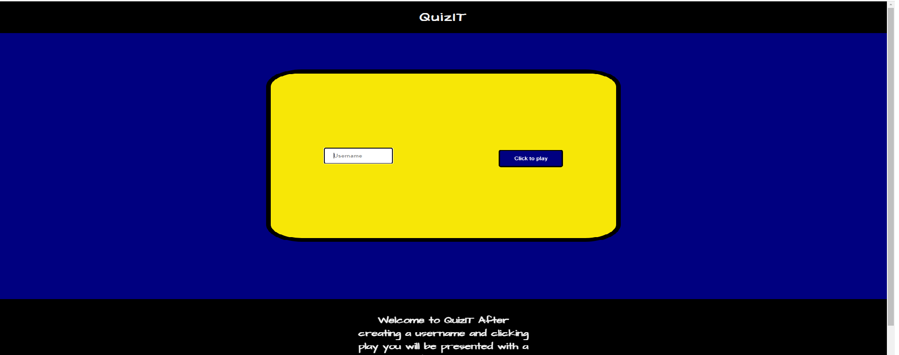

## Username and Play button
* Here the user can create a username for themself, and when they have created a username the user will be able to click on the playbutton to start the quiz.
 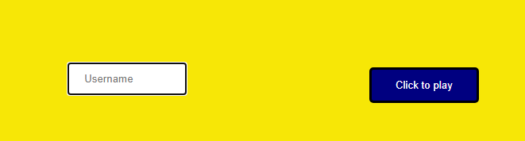

 ## Display message in header
* Here the user will be warned when the "username" input field is left empty, the user will also receive and alert warning message to inform that the input filed need to be filled in order to able to click play and continue.

## The quiz
* This is the quiz, you will have one question and two options to choose from, when the user hovers the mouse on the radiobutton the whole background turns blue. 
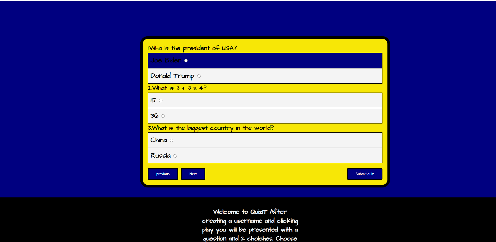

* When the user clicks previous on the first page it will display a message that encourages the user to click next button.
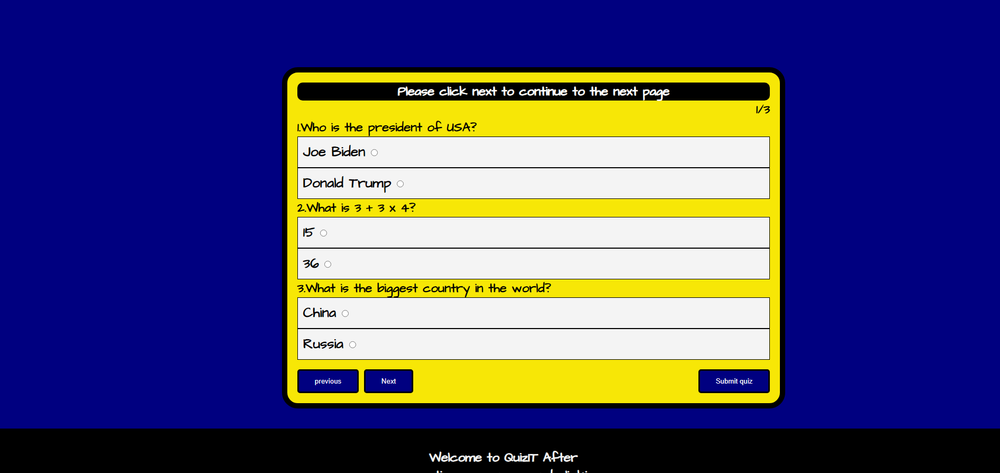

* On the last page if the user clicks next then a message above will appear telling the user to submit the quiz.
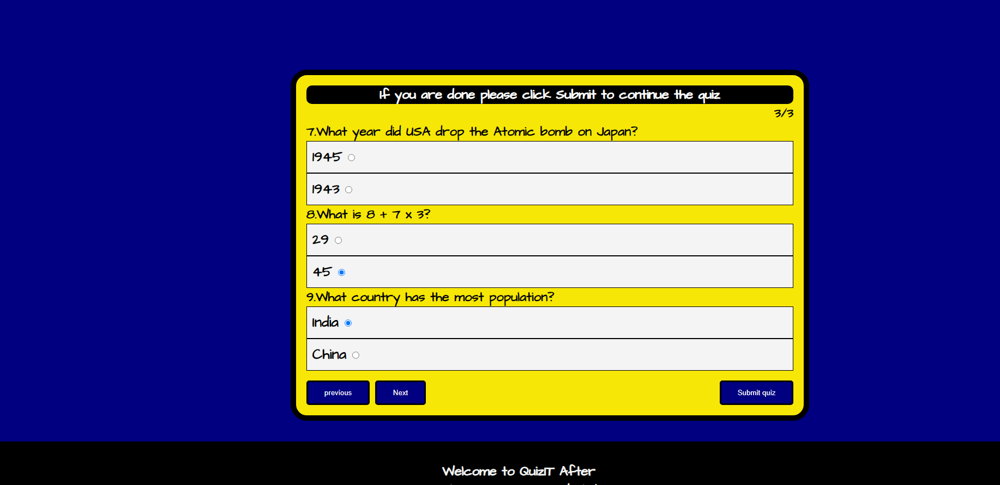
## Submit area
* After the user clicks submit the whole quiz will disappear and get access to a new area called the submit area. On this page the users name will be displayed along with how many questions the user got right. A picture will also appear depending on how many questions the user got right.
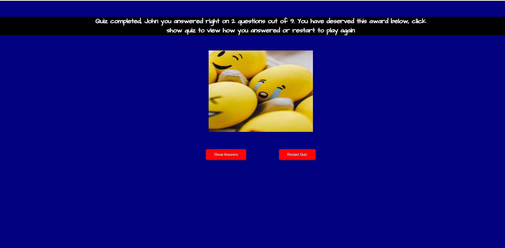

* When the user gets above 3 questions right after clicking submit this picture will appear with a "silver" present. 
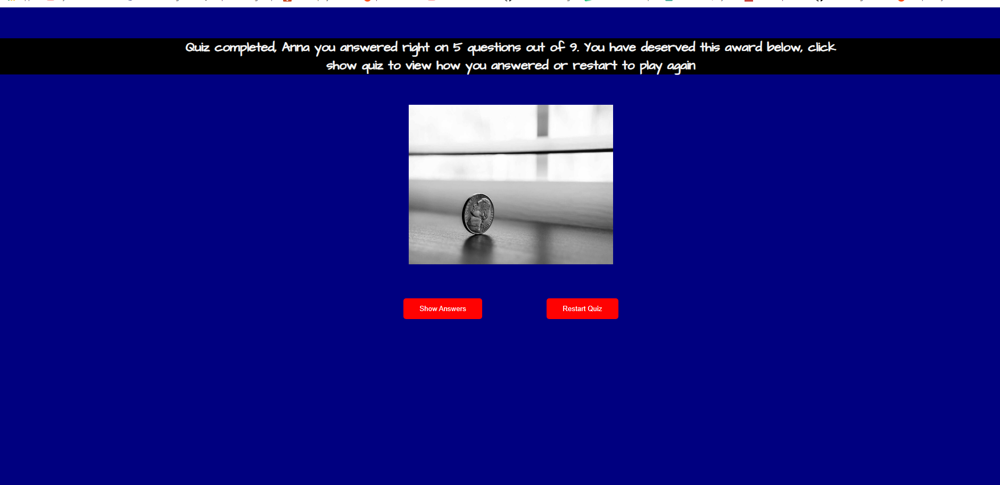

* When the user gets above 6 questions right after clicking submit this picture will appear with a "gold" present. 
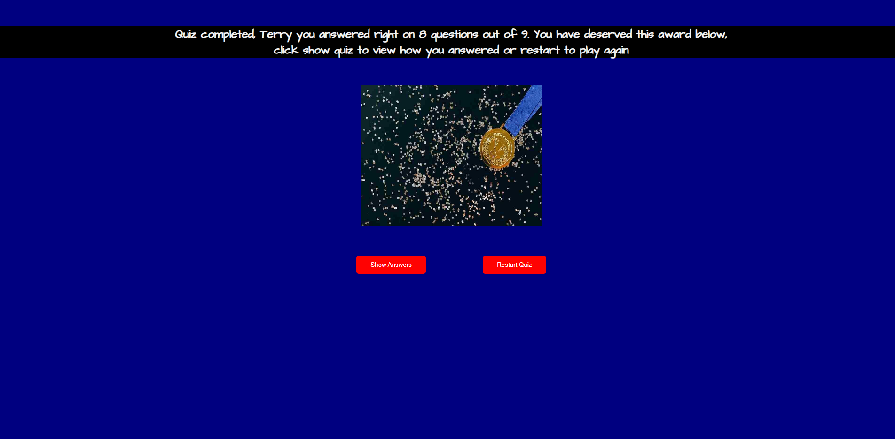

* The show answers button will reveal the whole quiz so that the user can see what questions was right or wrong. The restart quiz will take the user back to the home front page and the user will be able to play the quiz again with a new username.

* After the user clicks submit, the user will be presented with the quiz, all the wrong answers will be marked with a red background and all the right answers will be marked with green background. The next and previous buttons that was visable earlier are gone when displaying the answers for the user. 
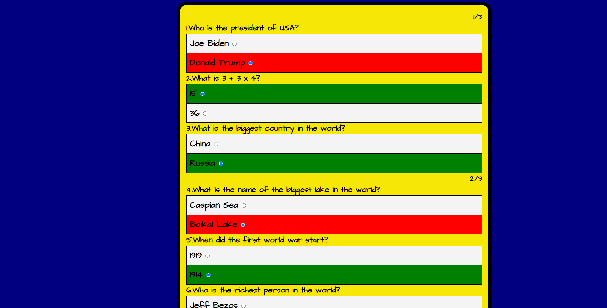

## Future ideas
In the future I would like to include more questions to the quiz, also a timer should be displayed telling the user how much time has passed by. When a certain time has past by the quiz will automatically stop.

## Technology

The technology to create the structure of the page was created with:
* HTML.

The styling of the page was created with:
* CSS.

The logic behind the page like calculating right answers and button inputs was created with:

* Javascript

The enivorment for coding was used from:
* Gitpod

The deployment of the site was created with:
* Github

## Testing
* The site was tested with three diffrent browsers, Brave, Google chrome and Microsoft Edge.

* I confirmed that the error message was displayed when the user clicks on previous button on the first page and next button on the last page.

* I confirmed that the user must write a username before being able to start the quiz.

* I confirmed that the images are diffrent based on the score that the user recieves after clicking submit.

# Supported screens
sasa

# Bugs
## Solved bugs
* Sometimes when you got to the last page after clicking submit the picture was empty and would look like this: 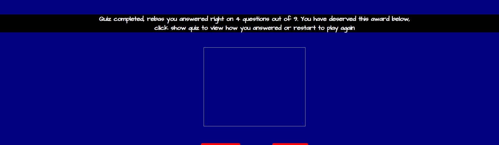
 The picture in the array was to big and took to long to load, i reduced the kb of the picture from 200 kb to 70 kb. The problem was gone after doing that.

# Validation of files
* The CSS was validated in Jigsaw and showed no errors.[Validate CSS](https://validator.w3.org/).

* The HTML file was validated with  the offical w3 html validation.[Validate html](https://validator.w3.org/).

Only error that I got was that I forgot to include an alt in my img tag.

* The Javascript file was validated by [Validate Javascript](https://jshint.com/).

 Warning that I got was :"let' is available in ES6 (use 'esversion: 6') or Mozilla JS extensions (use moz)." To fix this issue I wrote /*jshint esversion: 6 */ on top of the javascirpt file.

 I also got a warning saynig:"Missing "use strict" statement". In my functions, so I included a 'use strict'; in my functions to make that warning disappear.

 Following metrics was returned from the Javascirpt file:
 * There are 8 functions in this file.
 * Largest function has 45 statements in it, while the median is 7.5.
 * The most complex function has a cyclomatic complexity value of 19 while the median is 3.

* After fixing all the errors above I validated once more all the files to confirm that there is no warnings and all the files were good.
## Lighthouse Score
* I ran the page in the chrome devtools and checked with lighthouse my accessibility scire on the page and it all looked good.
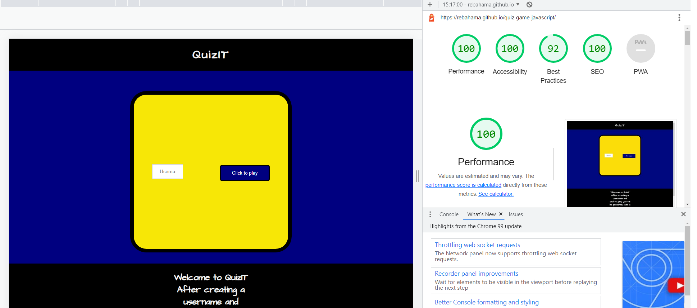

# Unfixed bugs

* No known bugs.

# Deployment

* Go to the repository quiz-game-javascript.
* Click on "settings" in the repository.
* Under "code and automation" there is a link called "pages", click on "pages".
* Under "source" select "branch" to "main" in the /root", click on save and the website will be live.

## Source code
To acess the source code in Gitpod.
* go to repository quiz-game-javascript.
* Click on the green button texted "Gitpod"
* After clicking the green button type: "python3 -m http.server" to run the terminal in "bash".
* Click on "open browser" to view the page.

Website link is here: [QuizIT](https://rebahama.github.io/quiz-game-javascript/).

# Credits
## Content
* To get started with collecting the values from radibuttons form I got help from this video: [Get started](https://www.youtube.com/watch?v=C7NsIRhoWuE)

* Fonts are from Google: [Google fonts](https://fonts.google.com/)

## Media
* All the pictures was taken from Pexels: [Picures](https://www.pexels.com/sv-se/)

